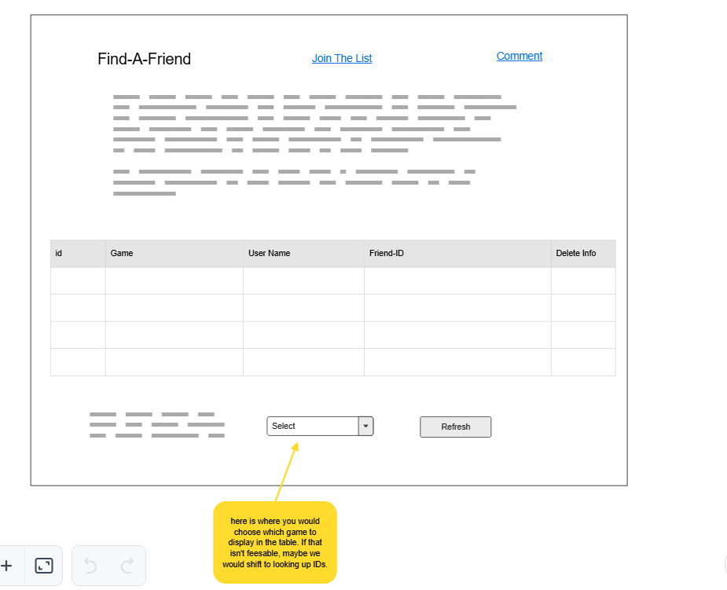
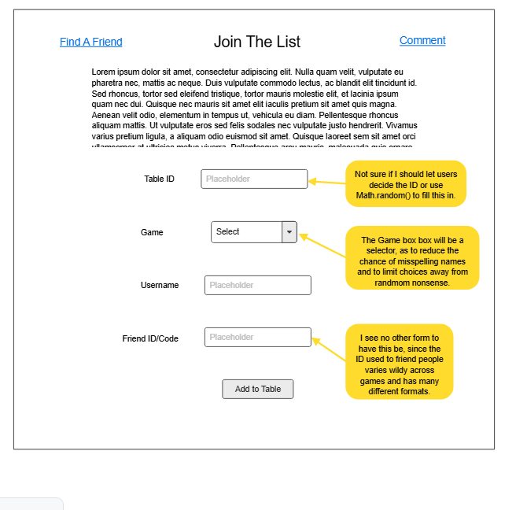
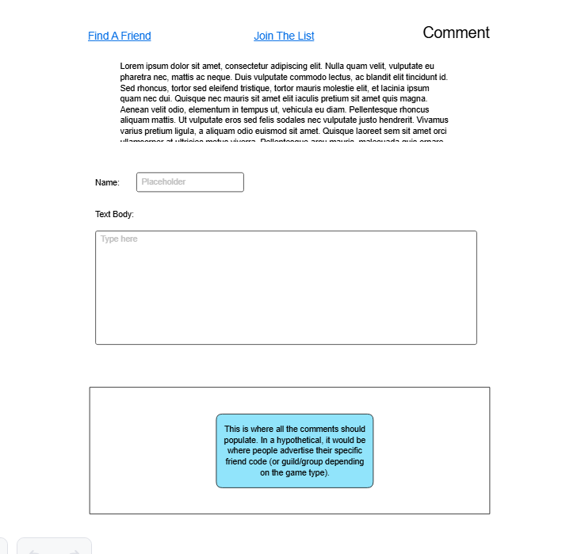

# CS 408 final project Find A Friend

## Project Spec

This is the repository for what will hopefully be a final project that I could theoretically use even after the class. This is supposed to serve as a website to host information about other people's friend codes in one centralized data table. Many games, mobile or otherwise, have a system in place where if you get the specific ID of someone else who also plays the same game, you can add them as a friend or join in some kind of clan/group for mutual benefits. You would usually have to go out of your way to find these or hope that the people who posted their codes on message boards years ago still play (not to mention the worry of interacting with a stranger). So, I figured that this would be a nice idea to try and bring to life with full-stack web development. 

I guess for a general theme, this would be closest to something like a messaging board. Yeah, the main page will be the table with all the IDs, but the page with the comments would be where the main activity would be if this were to go bigger. I would imagine it would be where people go to advertise themselves or their guild. It's either that or an information repository, but definitely not something like a photo gallery or a Twitter clone.

I stated this above, but for clarity, the main purpose of this project is to host the friend information for various online multiplayer games that allow you to "friend" other users and gain some benefit. The process of friending is usually done through some sort of code or unique ID, from what I have seen, so that is what will be shared here for others to use. Hopefully, you will be able to sort entries by game name so that you don't have to scroll through many entries for Clash of Clans and/or Genshin Impact when you just want to find other players for Clash Royale or something. Not every game is going to be listed as an option, as that would be an incredible amount of effort for little gain, since I would only realistically be able to juggle two games that have this sort of system in place.

The target audience would probably be fellow students. Even when I was coming up with this idea, it always came with the idea of it being something to share with my friends so that we could help each other out with our shared interests. At most, it could be something shared in a Discord server to allow quick access to information. That isn't to say that older people can't be the target focus if they want to be included, it's just that I wouldn't imagine they have enough time to spare for games like these to have it be a useful tool.

The data that will be stored here is probably user comments for the comment page. That's where I believe all the potential advertising and such should happen, and thus need to be dynamically created based on user input. The other data we would be storing is the friend ID for the various games being listed in the table. That would include usernames ( to confirm the code works), the game name, and the actual friend code to be used (in whatever form it may take). There is also a form to add information to the table. I don't believe that any other forms of data need to be stored. Something like image hosting isn't really needed for finding an online friend.

On the topic of stretch goals, I had the idea to add a button that would randomly get an image/meme related to one of the games listed on the Add list. Another could be to simply add more options to choose from in the game name category. Instead of having users put in their IDs manually, one could be assigned to them randomly. I am sure more possibilities will reveal themselves to me as I work on this, but for now, these are the types of stretch goals I can think of beyond just getting the project to work in the first place.

## Project Wireframe

Here are some example wireframes of what I think the base layout of the project should look like. 

